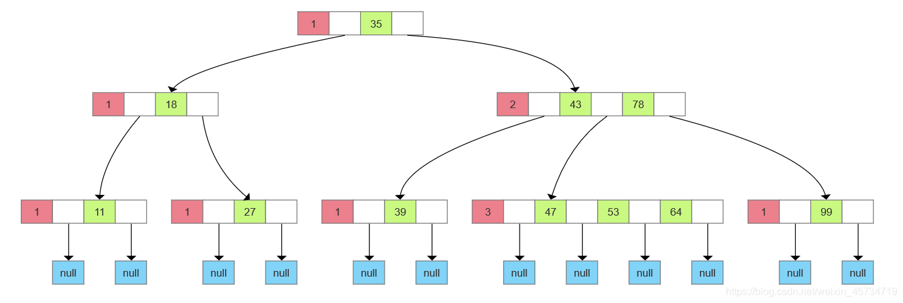
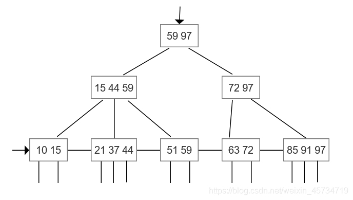
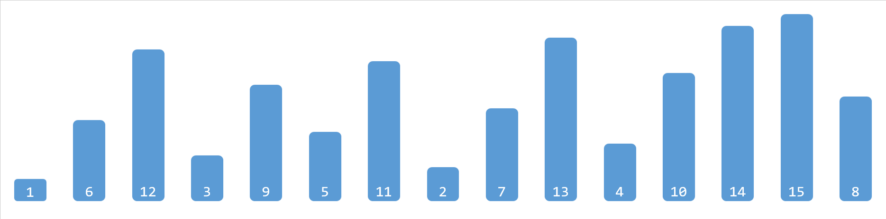
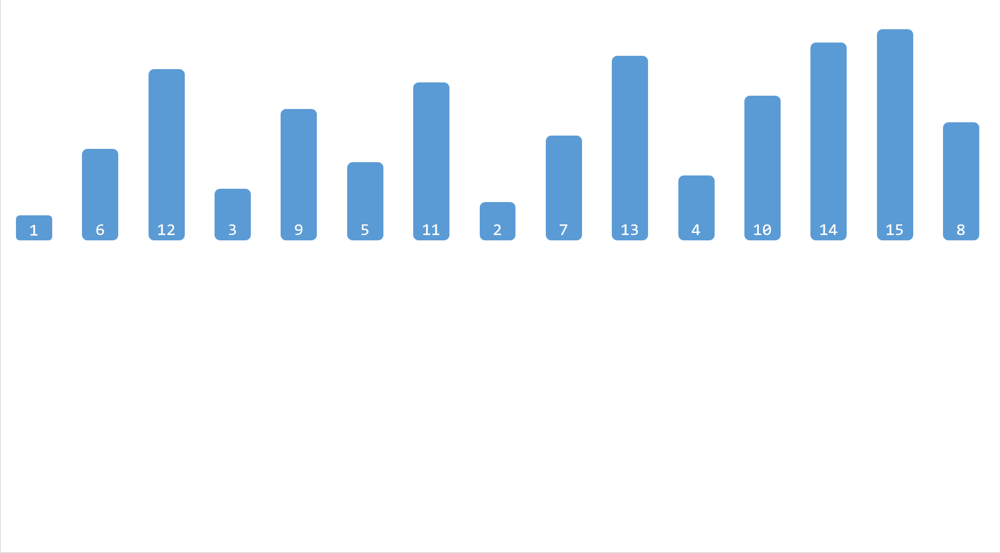

## 查找算法

|    查找算法      |  （平均）时间复杂度    |    空间复杂度     |    条件   |
| -------------- | ---------------------- | ---------------- | -------- |
| 顺序查找        | $$O(n)$$               | $$O(1)$$          |          |
| 二分查找        | $$O(log_2n)$$          | $$O(1)$$          | 有序     |
| 插值查找        | $$O(log_2(log_2n))$$   | $$O(1)$$          | 有序     |
| 斐波拉契查找    | $$O(log_2n)$$          | $$O(n)$$          | 有序     |
| 分块查找        | $$O(log_2n)\sim O(n)$$ | $$O(1)\sim O(n)$$ | 块间有序 |
| 树表查找（BST） | $$O(log_2n)$$          | $$O(1)$$          |          |
| 哈希查找        | $$O(1)$$               | $$O(n)$$          |          |

### 顺序查找

顺序查找也称为线形查找，属于**无序**查找算法。从数据结构线性表的一端开始，顺序扫描，依次将扫描到的结点关键字与给定值相比较，若相等则表示查找成功；若扫描结束仍没有找到关键字等于给定值的结点，表示查找失败。

### 二分查找

假设表中元素是按**升序**排列，将表中间位置记录的关键字与查找关键字比较，如果两者相等，则查找成功；否则利用中间位置记录将表分成前、后两个子表，如果中间位置记录的关键字大于查找关键字，则进一步查找前一子表，否则进一步查找后一子表。重复以上过程，直到找到满足条件的记录，使查找成功，或直到子表不存在为止，此时查找不成功。

注意，这里的前提条件是表中的元素是有序的，才能够使用二分查找算法。

### 插值查找

插值查找，有序表的一种查找方式。插值查找是根据查找关键字与查找表中最大最小记录关键字比较后的查找方法。插值查找基于二分查找，将查找点的选择改进为**自适应选择**，提高查找效率。

这里自适应选择是什么意思呢？举个栗子，如果现在有一个单词 `abandon` 你不认识，你想要在字典里查这个单词的意思，你会怎么做，你会先翻到书中间，然后一半一半地向前找吗？你肯定会会将书翻到比较靠前的位置，找到以 `a` 开头的位置，然后考察第二个字母，以此类推，直到查到这个单词。你将书翻到靠前的位置这个动作就是自适应，因为你知道 `abandon` 这个单词大概率在字典的前面（乱序字典不算）。

很显然，插值查找是二分查找的改进，同时又对二分查找做了进一步的限制，就是**待查找的元素要分布均匀**，根据待查找元素可能出现的位置的概率（期望）进行下一步的范围选择，这时插值查找的效率才会优于二分查找，具体的查找点选择方式如下：

二分查找中的 mid 索引：
$$
mid=\frac {low+high}{2}=low+\frac 12(high-low)
$$
插值查找中的 mid 索引：
$$
mid=low+\frac{des-array[low]}{array[high]-array[low]}(high-low)
$$

### 斐波那契查找

  也是二分查找的一种提升算法，通过运用黄金比例的概念在数列中选择查找点进行查找，提高查找效率。同样地，斐波那契查找也属于一种有序查找算法。

  相对于折半查找，一般将待比较的key值与第mid=（low+high）/2位置的元素比较，比较结果分三种情况：

1. 相等，mid位置的元素即为所求

2. \> ，low=mid+1

3. \<，high=mid-1

　　斐波那契查找与折半查找很相似，他是根据斐波那契序列的特点对有序表进行分割的。他要求开始表中记录的个数为某个斐波那契数，及n=F(k)-1;

  开始将k值与第F(k-1)位置的记录进行比较(及mid=low+F(k-1)-1),比较结果也分为三种

1. 相等，mid位置的元素即为所求
2. \>，low=mid+1,k-=2

3. \<，high=mid-1,k-=1

  说明：low=mid+1说明待查找的元素在[mid+1,high]范围内，k-=2 说明范围[mid+1,high]内的元素个数为n-(F(k-1))= Fk-1-F(k-1)=Fk-F(k-1)-1=F(k-2)-1个，所以可以递归的应用斐波那契查找。

### 分块查找

分块查找又称索引顺序查找，是对顺序查找的一种改进方法。在此查找方法中，除了表本身外，还需要建立一个**索引表**。对表进行分块，分成几个子表，将子表中的索引保存至索引表，索引表按关键字有序，则**分块有序**，即前一个子表中所有元素均小于后一个子表中所有元素（大于同理）。

因此，分块查找分为两步，第一步通过二分查找或顺序查找确定待查找元素所在的块，第二步，在块中进行顺序查找。

### 树表查找

#### 二叉排序树(BST)

二叉排序树（Binary Sort Tree）或是一棵空树，或是具有下列性质的二叉树：

1. 若它的左子树不为空，则左子树上的所有结点的值均小于它的根结点的值；
2. 若它的右子树不为空，则右子树上的所有结点的值均大于它的根结点的值；
3. 它的左右子树也是二叉排序树。

二叉排序树又称二叉查找树，它的查找过程如下，当二叉排序树不为空时，首先将给定值和根结点进行比较，若相等，则查找成功；若小于根结点，则在左子树上继续查找；若大于根结点，则在右子树上继续查找。

#### 平衡二叉排序树(BBT)

平衡二叉树（Balanced Binary Tree）又称 AVL 树。它或是一棵空树，或是具有下列性质的二叉树：它的左右子树均是平衡二叉树，且**左右子树的高度差的绝对值不超过1**。

如果构造二叉排序树的同时保证它是平衡二叉树，那么这样的树称为**平衡二叉排序树**（BBST），可以证明它的深度是和 O ( l o g 2 n ) O(log_2n)O(log2n) 一个数量级的，那么在进行查找时的时间复杂度就可以固定在 O ( l o g 2 n ) O(log_2n)O(log2n) ，而不会出现二叉排序树中的最坏的情况。

下面是一棵平衡二叉排序树：

平衡二叉排序树的查找过程和二叉排序树完全相同。

#### B-树

B-树是一种平衡的多路（查找路径不止两条）查找树，它在文件系统中很有用。
一棵 m 阶的B-树，或为空树，或为满足下列特性的 m 叉树：

1. 树中每个结点至多有 m 棵子树；
2. 若根结点不是叶子结点，则至少有两棵子树；
3. 除根之外的所有非终端结点至少有 m/2 棵子树；
4. 所有的非终端结点中包含下列信息数据

$$
(n,A_0,K_1,A_1,K_2,A_2,...,K_n,A_n)
$$

其中$$K_i$$为关键字，且$$K_i<K_{i+1}$$；$$Ai$$为指向子树根节点的指针，且$$K_{i+1}$$所指向的子树中的所有结点关键字均小于$$K_i$$，$$A_i$$所指向的子树所有关键字均大于$$K_i$$。

1. 所有的叶子结点都出现在同一层次上，且不携带信息（可以看作 null）。

特别地，3阶B-树又称为2-3树，下面是一棵4阶的B-树：

B-树的查找和二叉排序树类似，首先从根结点开始，逐层往下顺指针查找结点，然后在结点的关键字中进行查找。

举个栗子，如果要查找关键字47，首先从根节点开始，因为47>35，所以关键字若存在必在$$A_1$$所指的子树中，找到下一个结点，该节点有两个关键字，而43<47<78，所以关键字若存在必在$$A_1$$所指的子树中，找到下一个节点，该节点有3个关键字，顺序查找找到了关键字47。

由此可见，B-树的查找主要涉及两个操作：在树中找结点；在结点中找关键字。

#### B+树

B+树是应文件系统所需而出的一种B-树的变型树。一棵 m 阶的B+树和 m 阶的B-树的差异在于：

1. 有 n 棵子树的结点中含有n个关键字；
2. 所有的叶子结点中包含了全部关键字的信息，及指向含这些关键字记录的指针，且叶子结点本身依关键字的大小自小而大**顺序链接**。
3. 所有的非终端结点可以看成是索引部分，结点中仅含有其子树（根结点）中的最大（或最小）关键字。

下面是一棵3阶的B+树：

概括来说就是相比于B-树，B+树的非叶子结点不包含关键字的全部信息，仅保存最值充当索引，所有的数据信息保存在叶子结点中，而且叶子结点按关键字大小顺序链接。

因此，对于B+树，有两种查找算法，一种是从根结点开始进行随机查找；一种是从最小关键字开始，顺着链表顺序查找。随机查找基本和B-树相同，不同之处是，每次比较关键值相等时，并不会停止，而是会继续向下直到叶子结点。

#### 红黑树

红黑树是每个结点都带有颜色属性的二叉查找树，颜色或红色或黑色，相对于二叉查找树，红黑树增加了以下额外要求:

1. 结点是红色或黑色；
2. 根结点是黑色；
3. 所有叶子都是黑色；
4. 每个红色结点的两个子结点都是黑色（从每个叶子到根的所有路径上不能有两个连续的红色结点）；
5. 从任一节结点其每个叶子的所有路径都包含相同数目的黑色结点。

通过对任何一条从根到叶子简单路径上的颜色来约束，红黑树保证最长路径不超过最短路径的两倍，因而近似于平衡。

下面是一棵红黑树：

红黑树的基本思想是用标准的二叉查找树（完全由2-结点构成）和一些额外的信息（替换3-结点）来表示2-3树。

### 哈希查找

上面介绍的查找方法都是建立在”比较“的基础上进行的，通过有限次数的比较，不断缩小范围，直至查找完成。很显然，这种算法的效率依赖于查找过程中比较的次数。

那与没有一种方法可以不经过比较就得到待查找的记录呢？不难想到如果想要实现这种想法，就需要将关键字映射到一个唯一确定的位置，每次查找时只需要获取这个位置即可，问题就是如何确定这个映射关系。

这个映射关系称为**哈希（Hash）函数**或散列函数，按照这个函数映射出的表称为**哈希表**（Hash Table）或者散列表。

构造哈希函数的方法有很多，一个好的哈希函数因该尽可能地减少冲突，尽可能地将关键字均匀的映射到哈希表中。

常用的构造哈希函数地方法有：

1. 直接地址法：取关键字或关键字的某个线性函数值为散列地址。
2. 数字分析法：假设关键字是以 r 为基的数，并且哈希表中可能出现的关键字都是事先知道的，则可取关键字的若干数位组成哈希地址。
3. 平方取中法：取关键字平方后的中间几位为哈希地址。
4. 折叠法：将关键字分割成位数相同的几部分（最后一部分的位数可以不同），然后取这几部分的叠加和（舍去进位）作为哈希地址。
5. 除留取余法：取关键字被某个不大于散列表表长m的数p除后所得的余数为哈希地址。
6. 随机数法：选则一个随机函数，取关键字的随机函数值为它的哈希地址。

常用的处理冲突的方法有：

1. 开放地址法
2. 再哈希法
3. 链地址法
4. 建立公共溢出区

哈希查找的操作步骤：

1. 用给定的哈希函数构造哈希表；
2. 根据选择的冲突处理方法解决地址冲突；
3. 在哈希表的基础上执行哈希查找。

在哈希查找的过程中，只需先将要查找的数据映射为它的哈希值，然后查找具有这个哈希值的数据，这就大大减少了查找次数。如果构造哈希函数的参数经过精心设计，内存空间也足以存放哈希表，查找一个数据元素所需的比较次数基本上就接近于一次。

## 排序算法

| 排序算法 | 平均时间复杂度   | 空间复杂度    | 稳定性 |
| -------- | ---------------- | ------------- | ------ |
| 冒泡排序 | $$O(n^2)$$       | $$O(1)$$      | 稳定   |
| 选择排序 | $$O(n^2)$$       | $$O(1)$$      | 不稳定 |
| 插入排序 | $$O(n^2)$$       | $$O(1)$$      | 稳定   |
| 希尔排序 | $$O(n^\frac32)$$ | $$O(1)$$      | 不稳定 |
| 归并排序 | $$O(n*log_2n)$$  | $$O(n)$$      | 稳定   |
| 快速排序 | $$O(n*log_2n)$$  | $$O(log_2n)$$ | 不稳定 |
| 堆排序   | $$O(n*log_2n)$$  | $$O(1)$$      | 不稳定                                  |
| 计数排序 | $$O(n+k)$$       | $$O(k)$$      | 稳定   |
| 桶排序   | $$O(n+c)$$       | $$O(n+m)$$    | 稳定   |
| 基数排序 | $$O(n(n+r))$$    | $$O(r*d)$$    | 稳定   |

- n 个记录个数

- d 个关键字

- r 为关键码的取值范围

### 交换排序

#### 冒泡排序

将相邻关键字进行比较，较大的下沉，较小的上浮（假设要求升序排列，后算的算法相同），一趟过后最大的关键字会到末尾，借着按照同样的方式进行第二轮比较，次大的关键字会到倒数第二位，以此类推。

在排序的过程中，较小的关键字形如水里的泡泡一样，逐渐向上漂浮，而较大的关键字像石头一样不断下沉，因此这种算法被形象地称为**冒泡**排序。

#### 快速排序

快速排序是对冒泡排序的一种改进，它同样采用了分治的策略，算法思想如下：

1. 先从数列中取出一个数作为基准数（pivot）。
2. 分区过程，将比这个数大的数全放到它的右边，小于或等于它的数全放到它的左边。
3. 再对左右区间重复第二步，直到各区间只有一个数。

快速排序的难点在于如何将基准数放在正确的位置上，常见方法有两种：挖坑法和指针交换法，两种方法的原理几乎相同，只是代码层面有一点不同，挖坑法的具体演示如下图。

### 选择排序

#### 简单的选择排序

每一趟在 n-i+1 (i=1,2,…,n-1) 个记录中选取关键字最小的元素作为有序序列的第 i 个元素，重复 n-1 趟。

#### 堆排序

堆排序是利用**堆**这种数据结构所设计的一种排序算法。堆是一个近似完全二叉树的结构，并同时满足堆积的性质：即子结点的键值或索引总是小于（或者大于）它的父节点。

### 插入排序

在要排序的一组数中，假定前 n-1 个数已经排好序，现在将第 n 个数插到前面的有序数列中，使得这 n 个数也是排好顺序的。如此反复循环，直到全部排好顺序。

#### 简单插入排序

希尔排序又称“**缩小增量排序**”，它也是一种属于插入排序类的方法。

从对直接插入排序的分析来看，如果序列基本有序，那么元素移动的次数就会大大减少，当 n 值很小时，直接插入排序的效率也会非常高，基于此，希尔排序对直接插入排序进行了改进，其基本思想如下：

在要排序的一组数中，根据某一增量分为若干子序列，并对子序列分别进行插入排序。然后逐渐将增量减小，并重复上述过程。直至增量为1，此时数据序列基本有序，最后进行插入排序。

#### 希尔排序

希尔排序又称“**缩小增量排序**”，它也是一种属于插入排序类的方法。

从对直接插入排序的分析来看，如果序列基本有序，那么元素移动的次数就会大大减少，当 n 值很小时，直接插入排序的效率也会非常高，基于此，希尔排序对直接插入排序进行了改进，其基本思想如下：

在要排序的一组数中，根据某一增量分为若干子序列，并对子序列分别进行插入排序。然后逐渐将增量减小，并重复上述过程。直至增量为1，此时数据序列基本有序，最后进行插入排序。

### 归并排序

归并排序是建立在归并操作上的一种有效，稳定的排序算法，该算法是采用分治法（Divide and Conquer）的一个非常典型的应用。

分治法中的“分”和“治”是两个过程，“分”是不断地将序列分成从中间两段，直至最后子序列只有一个元素；“治”是将一个个的子序列进行排序得到有序的子序列，再将子序列合并得到完全有序的序列，即先使每个子序列有序，再使子序列段间有序。若将两个有序表合并成一个有序表，称为**二路归并**。

### 计数排序

计数排序不是一个基于比较的排序算法。

计数排序的基本思想是对于给定的输入序列中的每一个元素 x，确定该序列中值小于 x 的元素的个数（此处并非比较各元素的大小，而是通过对元素值的计数和计数值的累加来确定）。一旦获得该信息，就可以将 x 直接存放到最终的输出序列的正确位置上。例如有 10 个年龄不同的人，统计出有 8 个人的年龄比 A 小，那 A 的年龄就排在第 9 位。

计数排序的核心在于将输入的数据值转化为键存储在额外开辟的数组空间中。作为一种线性时间复杂度的排序，计数排序要求输入的数据必须是有确定范围的整数。

### 桶排序

桶排序是计数排序的升级版，它的基本思想是将数组分到有限数量的桶里，每个桶再进行排序（可以使用别的排序算法或是以递归方式继续使用桶排序）。

将数组分配到有限数量的桶里需要一个高效的分配方法，尽可能地做到：

1. 在额外空间充足的情况下，尽量增大桶的数量
2. 将输入的 N 个数据均匀的分配到 K 个桶中

对于桶中元素的排序，选择何种比较排序算法对于性能的影响同样重要。

### 基数排序

基数排序是一种基于多关键字排序的的方法，什么是**多关键字**？举个栗子：

一副扑克牌（除去大小王），每张牌的位置由两个因素决定，一个是花色，一个是面值。同花色时面值小的在上，面值大的在下；不同花色，无论面值多少，先后顺序总是红桃♥、方片♦、梅花♣和黑桃♠ 。这里花色和面值就是多关键字。

现在这副牌已经洗乱了，现在你想给它排好序，就像刚买的时候一样，这个时候你会怎么做？你有两种做法：

1. 按照花色分成四份，每份按照面值排序，最后将四分排序好的牌按花色排序即可；
2. 按照面值分成13份，每份按照花色排序，然后按照面值顺序取13张牌，直至所有花色取完即可。

这里两种方式对应着基数排序的两种方法，第一种是**最高位优先**（Most Significant Digit first）法，简称 MSD 法；第二种是**最低位优先**（Least Significant Digit first）法，简称 LSD 法。

MSD 法：先按最高位关键字排序分组，同一组中记录，关键字相等，再对各组按次高位关键字排序分成子组，之后，对后面的关键字继续这样的排序分组，直到按最低位关键字对各子组排序后。再将各组连接起来，便得到一个有序序列。

LSD 法：先从最低位关键字开始排序，再对高一位关键字进行排序，依次重复，直到对第一个关键字排序后便得到一个有序序列。

## 图算法

### 路径查找算法

#### 广度优先搜索算法

#### 深度优先搜索算法

#### 最短路径算法

#### 所有点对最短路径算法

#### 单源最短路径算法

#### 最小生成树算法

#### 随机游走算法

### 中心性算法

#### 度中心性算法

#### 接近中心性算法

#### 中间中心性算法

#### PageRank算法

### 社团发现算法

#### 度量算法（面向整体关系稠密度，用于衡量图的结构特性）

#### 分量算法（用于发现连通簇）

#### 标签传播算法（可基于节点标签快速推断群组）

#### Louvain模块度算法（用于研究分组的
